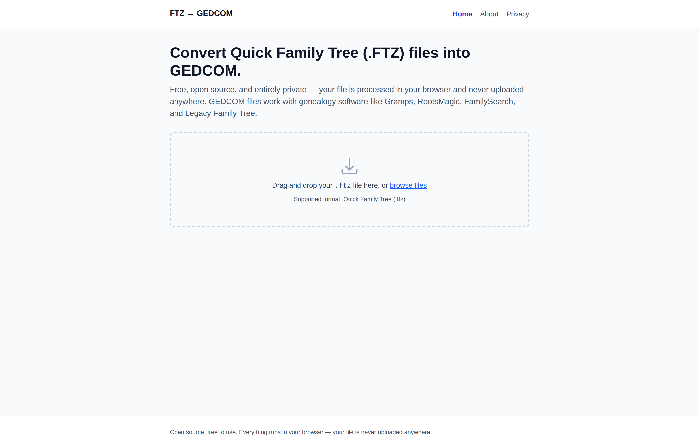
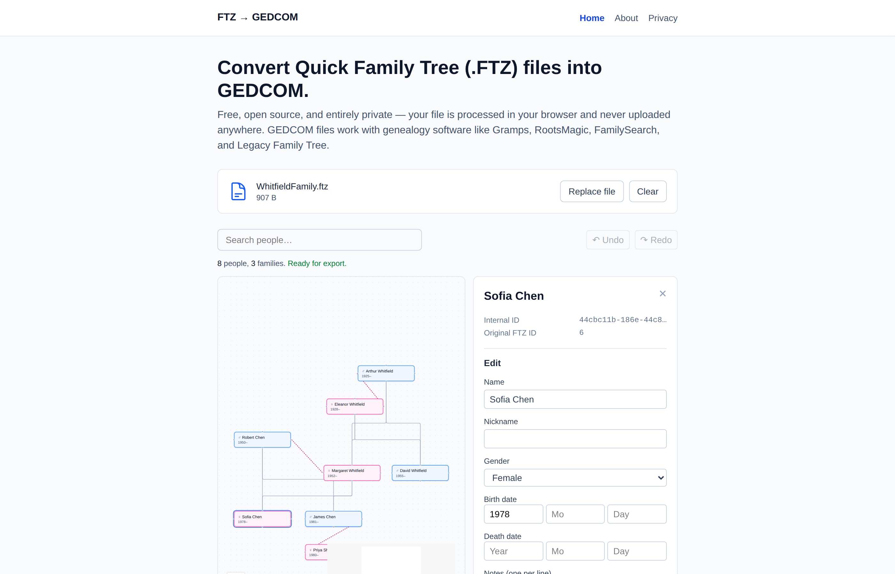

# TreeBridge — FTZ → GEDCOM Converter

*(working project name — see `docs/brand-guide.md`; the tool itself is unaffected either way)*

Convert Quick Family Tree (`.ftz`) exports into standards-compliant GEDCOM (`.ged`) files —
explore and fix up the tree first if you need to, then convert. Everything runs in your
browser. Free, open source, and nothing is ever uploaded anywhere.



## Why this exists

Quick Family Tree is a mobile app with an undocumented, proprietary export format. If the
app disappears, so does every family tree exported from it — unless that data is moved into
GEDCOM, the open, vendor-neutral standard that every serious genealogy program understands
(Gramps, RootsMagic, Legacy Family Tree, FamilySearch, and more). This project exists to make
that move possible without paying for or trusting a closed conversion service with your
family's data.

## What it does

1. **Upload** your `.ftz` file (drag-and-drop or browse). Parsing happens in a Web Worker, in
   your browser — the file is never sent anywhere.
2. **Explore** the tree visually: search by name or ID, browse generations, see parents,
   spouses, children, and siblings for anyone.
3. **Fix up data, if you want to.** Correct a name, assign a missing parent, merge a
   duplicate, remove a broken relationship — every edit is validated immediately and fully
   undoable. This step is optional; skip straight to export if your data is already clean.
4. **Export** to GEDCOM 5.5.1 and download the `.ged` file.

   

Your edits exist only for the current browser session unless you explicitly export — closing
the tab discards them, and the original uploaded file is never modified. See the Privacy page
in the app, or [`web/src/pages/PrivacyPage.tsx`](web/src/pages/PrivacyPage.tsx).

## Try it

```bash
git clone <repo-url>
cd Family-Tree
npm install
cd web && npm run dev
```

Then open `http://localhost:5173`, drop in a `.ftz` file, and go.

## How it's built

```
FTZ file
  │
  ▼
ZIP extraction + node.ftt parsing      (parser/)
  │
  ▼
Internal data model + validation       (models/, validation/)
  │
  ▼
Explore & edit (optional)              (editor/, web/ — React Flow visualization)
  │
  ▼
GEDCOM 5.5.1 generation                (gedcom/)
  │
  ▼
Download — all of the above runs       (web/ — Web Worker, entirely client-side)
in your browser, nothing leaves it
```

Every stage was built and verified as its own milestone, each with its own documentation:

| Doc | Covers |
|---|---|
| [`docs/architecture-overview.md`](docs/architecture-overview.md) | **Start here** — a guided tour of the whole pipeline for new contributors |
| [`docs/ftz-format-spec.md`](docs/ftz-format-spec.md) | The reverse-engineered FTZ/`node.ftt` format, field by field, with confidence levels |
| [`docs/validation-report.md`](docs/validation-report.md) | Relationship reconstruction + integrity checks against the real sample data |
| [`docs/data-model.md`](docs/data-model.md) | The internal `FamilyTree`/`Person`/`Family` model and why it's shaped the way it is |
| [`docs/gedcom-mapping.md`](docs/gedcom-mapping.md) | Every FTZ field's GEDCOM mapping, confidence, and data-loss notes |
| [`docs/parser-spec.md`](docs/parser-spec.md) / [`docs/parser-implementation.md`](docs/parser-implementation.md) | Parser design and the real implementation |
| [`docs/gedcom-exporter.md`](docs/gedcom-exporter.md) | Exporter design, GEDCOM compatibility testing (including a real Gramps import test), known limitations |
| [`docs/explorer-architecture.md`](docs/explorer-architecture.md) | Tree explorer, in-browser editing, visualization, undo/redo, and state management |
| [`docs/architecture-plan.md`](docs/architecture-plan.md) | Repo structure and a critical risk review |
| [`docs/security-privacy-review.md`](docs/security-privacy-review.md) | What data ever leaves your device (nothing), and why |
| [`docs/performance-report.md`](docs/performance-report.md) | Measured load/parse/edit/export timings against real and synthetic data |
| [`docs/audit-findings.md`](docs/audit-findings.md) | Real bugs found and fixed during the v1.0 release-readiness engineering audit |
| [`docs/roadmap.md`](docs/roadmap.md) | What's planned for v1.1, v1.2, and beyond |
| [`docs/release-notes-v1.0.md`](docs/release-notes-v1.0.md) | Version 1.0 release notes |

## Privacy, in one sentence

Your file is read, parsed, edited, and converted entirely by JavaScript running in your own
browser tab; this project has no backend, sends no analytics, and cannot see your data even
if it wanted to. See [`docs/security-privacy-review.md`](docs/security-privacy-review.md) for
the full, verified breakdown — not just the claim.

## Testing with real data

This project was developed and validated against a real, privately-owned Quick Family Tree
export (473 people, 136 families) — real names, dates, and notes about real people. That file
is **intentionally not committed to this repository**; it's gitignored (`Family Tree FTZ/`,
`samples/`). Every screenshot in this README uses a small, entirely fictional family instead.

If you're developing locally and have your own `.ftz` file, drop it at
`Family Tree FTZ/FamilyTree.ftz` and the full test suite (including the real-sample and
end-to-end tests) will pick it up automatically — those tests skip gracefully when the file
isn't present (e.g. in CI), and run for real when it is. See `CONTRIBUTING.md`.

## Project status: Version 1.0

Upload → validate → explore → edit → export → download, all working end to end, tested
against both synthetic fixtures and a real 473-person export, including a real Gramps import.
104 tests in the parser/validation/editor/GEDCOM package, 66 in the web app (component,
integration, accessibility). See [`docs/roadmap.md`](docs/roadmap.md) for what's next —
GEDCOM import, CSV import, photo support, and more are planned but not yet built.

## Development

This is an npm workspace: the parser/editor/exporter live at the repo root as a plain
TypeScript package (no framework dependency), and the web app lives in `web/` and imports
them directly — there is exactly one implementation of the FTZ↔GEDCOM logic, not a copy per
surface.

```bash
# from the repo root
npm install             # installs both the root package and web/

npm test                 # parser/validation/editor/GEDCOM test suite (104 tests)
npm run typecheck         # root package

cd web
npm run dev                # start the dev server
npm test                    # web app test suite (66 tests: component + integration + a11y)
npm run typecheck
npm run build                 # production build
npm run lint
```

See [`CONTRIBUTING.md`](CONTRIBUTING.md) for the full development guide, coding standards,
and how to submit a change.

## FAQ

**Does this work with any family tree app, or just Quick Family Tree?**
Just Quick Family Tree's `.ftz` export today — that's the only format this project reverse-
engineered and validated. GEDCOM *import* (to go the other direction, or to convert from a
different app) is on the [roadmap](docs/roadmap.md) but not built yet.

**Is my data really never uploaded anywhere?**
Yes — there is no backend for it to go to. Open your browser's Network tab while using the
app and watch for yourself; nothing but the app's own static files load over the network. See
[`docs/security-privacy-review.md`](docs/security-privacy-review.md).

**What happens to fields this tool doesn't understand?**
They're preserved, not discarded — every original field is kept on the internal record even
if it isn't yet mapped to GEDCOM, and anything genuinely uncertain is surfaced as a validation
warning rather than silently dropped or guessed at. See `docs/data-model.md`.

**Can I edit my tree before converting it?**
Yes — the built-in explorer lets you fix names, dates, and relationships, with full undo/redo,
before you export. Edits only apply to your in-browser session; the original file is never
touched, and nothing is saved anywhere unless you click Export.

**I found a bug / the conversion looks wrong. What do I do?**
Open an issue using the bug report template — and please don't attach your real `.ftz`/`.ged`
file (see `CONTRIBUTING.md`). Describe the shape of the problem instead.

## Roadmap

See [`docs/roadmap.md`](docs/roadmap.md) for the full plan. Short version: GEDCOM import, CSV
import/export, photo support, a duplicate-person merge tool, and a printable chart view are
the leading candidates for what comes after v1.0.

## Contributing

Contributions are welcome — see [`CONTRIBUTING.md`](CONTRIBUTING.md) for the project layout,
coding standards, and how to submit a change. Please also read
[`CODE_OF_CONDUCT.md`](CODE_OF_CONDUCT.md) and, for anything security- or privacy-related,
[`SECURITY.md`](SECURITY.md).

## Deployment

This app deploys to Vercel with zero manual build configuration — see
[`DEPLOYMENT.md`](DEPLOYMENT.md) for the one-time setup (push to GitHub, connect to Vercel)
and the branch-protection settings that make CI failures actually block merges.

## License

[MIT](LICENSE)
